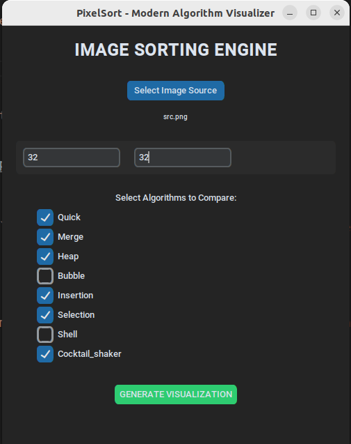
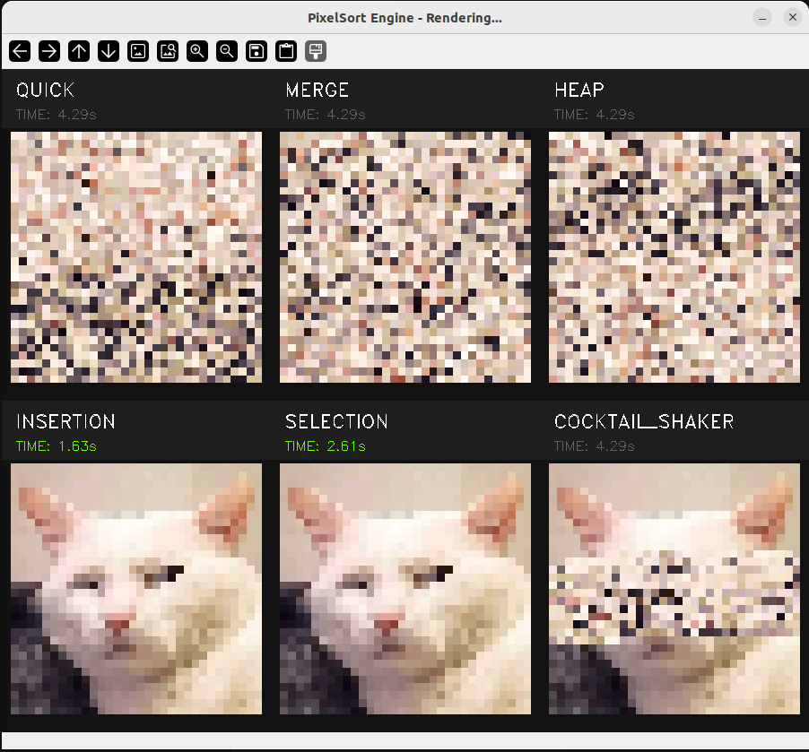

### Installation

```bash
python -m venv .venv

source .venv/bin/activate

pip3 install -r requirements.txt
```

### How to run?

#### GUI
Just run the script: `python main.py` — This will pop up a window to pick your image and type your dimensions.



Rendering interface


#### CLI
Use CLI for automation: `python main.py --image my_pic.jpg --width 40 --height 40` — This bypasses the GUI.

**More in CLI:**

```bash
python main.py --image small.png --algos quick merge heap bubble insertion selection
```